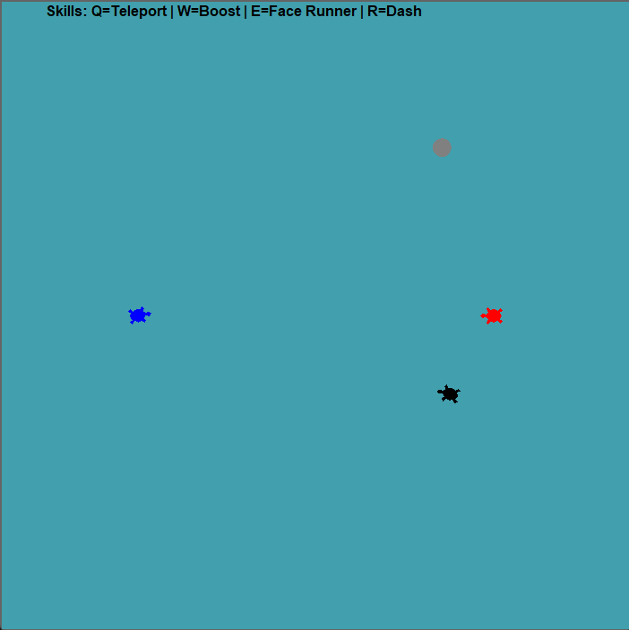
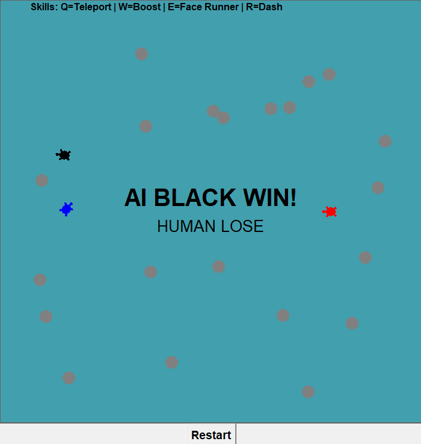

# Turtle Runaway Game

## 소개
이 프로젝트는 **Python `turtle` + `tkinter`** 기반으로 구현된 간단한 **추격 게임**입니다.  
플레이어(빨간색 거북이)는 키보드 입력과 **스킬(Q/W/E/R)**을 사용해 파란색 러너를 추격하며, AI(검정색 거북이)와 경쟁하게 됩니다.  

추가적으로:
- **장애물**이 랜덤하게 맵에 생성되며, 충돌 시 패널티가 적용됩니다.
- **스코어 시스템**과 **타이머**가 포함되어 있습니다.
- **10점에 먼저 도달한 쪽이 승리**하며, 게임 종료 후 `Restart` 버튼으로 재시작할 수 있습니다.

---

## 게임 방법

### 조작키
- **이동**
  - ⬆️ `Up` : 전진
  - ⬇️ `Down` : 후진
  - ⬅️ `Left` : 좌회전
  - ➡️ `Right` : 우회전

- **스킬**

  - `Q` : 랜덤 위치로 순간이동 (Teleport)
  - `W` : 1초간 이동 속도 2배 (Boost)
  - `E` : 러너(Runner) 방향을 바라봄 (Face Runner)
  - `R` : 러너 방향으로 돌진 (Dash)

### 점수 규칙

- 러너를 잡으면 점수 +1  
- 장애물에 부딪히면 점수 -1 (0점 아래로는 떨어지지 않음)  
- 먼저 **10점**에 도달한 플레이어가 승리  

---

## 게임 화면
- **빨간색**: 플레이어 (ManualMover)  
- **파란색**: 도망자 (Runner, 랜덤 이동)  
- **검은색**: AI 추격자 (AutoChaser)  
- **회색 원**: 장애물 (랜덤 생성)  

---
